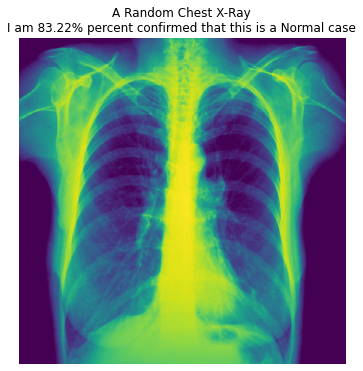

## Chest X-Ray Prediction

## Data Understanding¶
- The data comes from chest X-ray images (anterior-posterior) that were selected from retrospective cohorts of pediatric patients of one to five years old from Guangzhou Women and Children’s Medical Center, Guangzhou.
- This data is composed of three different pieces:
- Train set
- Test set
- Validation set
- A limitation to the data set as a whole is that the images are from a very specific age range. This might create some issues with the data.

### Preparing the Data
- Importing relevant libraries to operate on the data.
- Defining the directories for the data.
- Creating a function to help visualize our model results. 

## Parameters
- The batch refers to the number of training examples utilized in one iteration.
- The dimension of the images we are going to define are 500x500.
- The dimension size of 500 or more with a batch size greater than 16 may result in a crash as the RAM gets completely used in such cases. 
- A lower dimension size with greater batch size is one of the options to try.

## Creating an Image Data Generator
- We will increase the size of the image training dataset artificially by performing an Image Augmentation technique. Image Augmentation expands the size of the dataset by creating a modified version of the existing training set images that helps to increase dataset variation and ultimately improve the ability of the model to predict new images.
- The image generator is for:
 1. Train set
 2. Test set

## Loading up the Images
- The Image Data Generator has a class known as flow from the directory which reads the images from the folders containing the images.
- This will return the DirectoryIterator typetensorflow.python.keras.preprocessing.image.DirectoryIterator.
- Code for images can be found <a href="https://www.kaggle.com/sanwal092/intro-to-cnn-using-keras-to-predict-pneumonia">here.</a>

## CNN
- CNN architecture is based on layers of convolution. 
- The convolution layers receive input and transform the data from the image and pass it as input to the next layer. 
- The transformation is known as the operation of convolution.
- It is necessary to define the number of filters for each convolution layer. 
- These filters detect patterns such as edges, shapes, curves, objects, textures, or even colors. 
- The more sophisticated patterns or objects it detects are more deeply layered.

## Initial Baseline Model
- Just exploring the data.
- Seeing what an initial model spits out.
- Tried out a few initializers just to see what would happen.
- Initializers:
 1. Zeros - Generates 0 for all input data.
 2. TruncatedNormal - Generates value using truncated normal distribution of input data. The truncated normal distribution is the probability distribution derived from that of a normally distributed random variable by bounding the random variable from either below or above.

### Important things to think about before starting to build a CNN model:
1. Always begin with a lower filter value such as 32 and begin to increase it layer wise. (find out why?)
2. Construct the model with a layer of Conv2D followed by a layer of MaxPooling.
3. The kernel_size is a preferred odd number like 3x3.
4. Tanh, relu, etc. can be used for an activation function, but relu is the most preferred choice.
5. (input_shape) takes three arguments, the images width & height and dimension as color channel.
6. Flatten the input after the CNN layers and then add ANN layers.
7. Use the activation function as softmax for the last layer. If the problem is more than 2 classes, define units as the total number of classes and use sigmoid for binary classification and set unit to 1.

## Evaluate
- Find the models accuracy.
- Predicting the test dataset.
- Taking a peak at some of the performance measurement metrics in detail to evaluate our model.

## Classification Report
- Precision = TruePositives / (TruePositives + FalsePositives)
 - The precision score explains how precise/accurate your model is out of those predicted positive. Meaning, how many of them are actually positive.
- Recall = TruePositives / (TruePositives + FalseNegatives)
 - Recall calculates how many of the actual positives our model captured through labeling them as positive (true positive).
- F1 = (2 * Precision * Recall) / (Precision + Recall)
 - F1 Score can be a better measure to use if we need to seek a balance between precision and recall. Especially if there is an uneven class distribution (large number of actual negatives).

![download-1.png]
